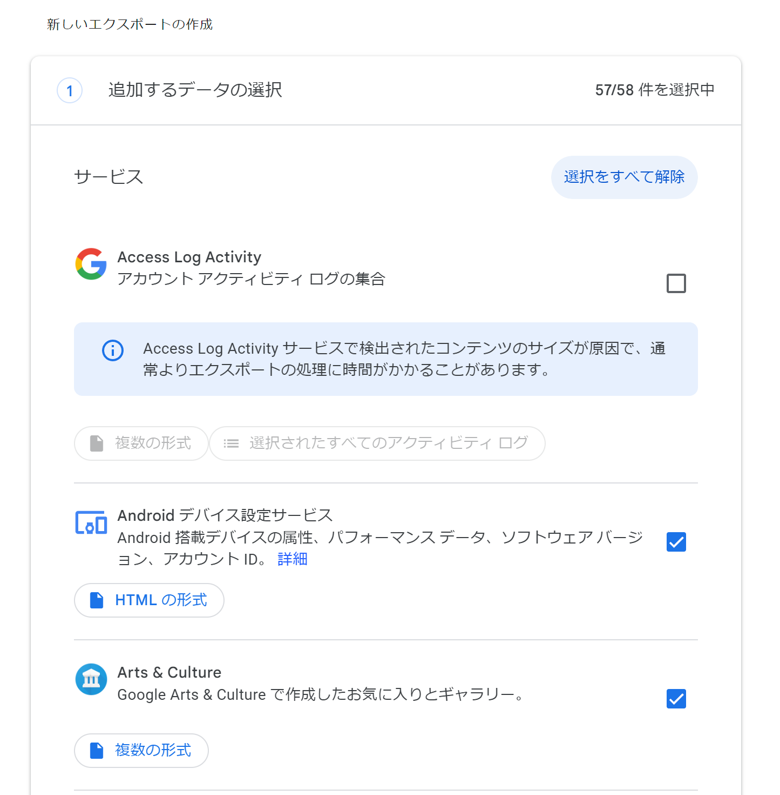
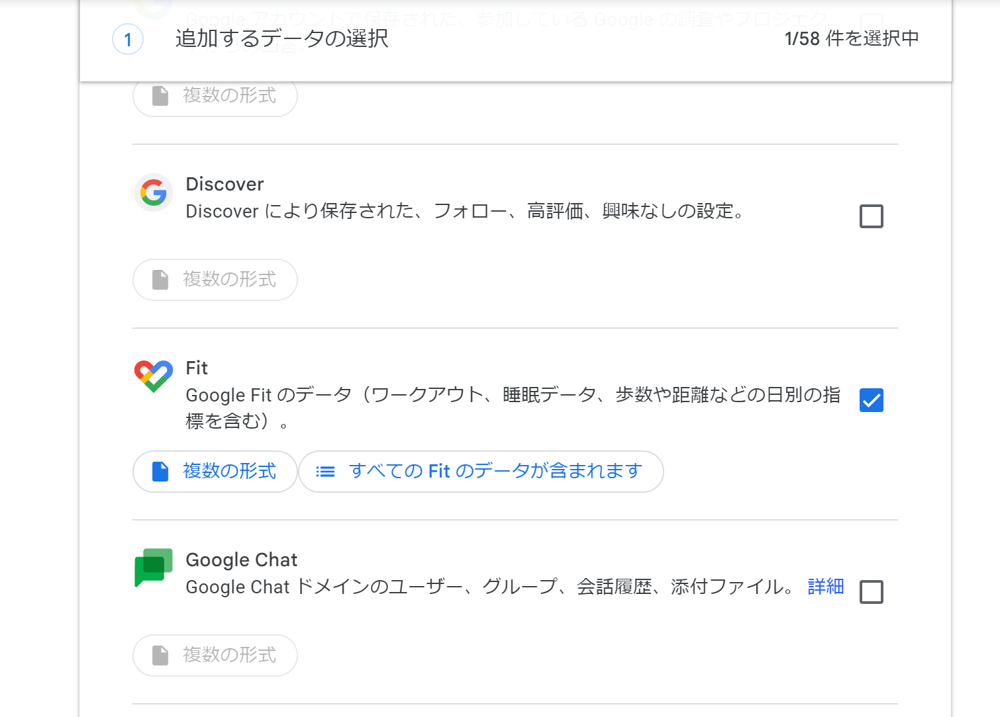
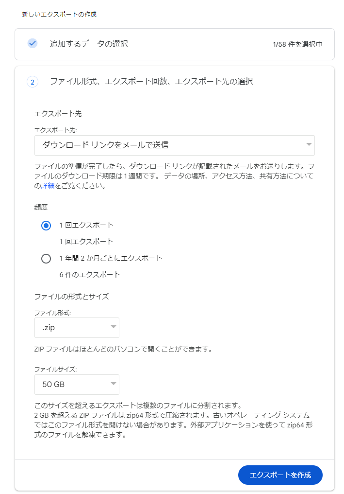
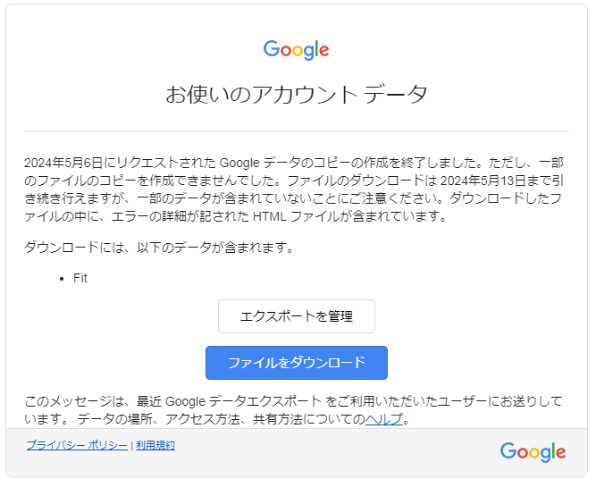
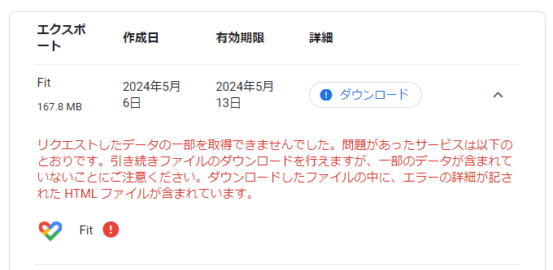

## Google Fit からデータをダウンロードする方法

1. [Google データ エクスポート](https://takeout.google.com/)にアクセスします。
2. `追加するデータの選択` にて`選択をすべて解除`します(余計なデータが多すぎるため)。

    
    
3. `Fit`(Google Fit)のみを選択します。
    
    
    
4. 一番下までスクロールし、`次のステップ`をクリックします。
5. ファイル形式、エクスポート回数、エクスポート先の選択をします。
   - `エクスポート先` は `ダウンロードリンクをメールで送信`を選択します
   - `頻度`は`1回エクスポート`を選択します
   - `ファイル形式`は`.zip`を選択します
   - `ファイルサイズ`は`50GB`を選択します(念の為)
   - 上記を確認した後、`エクスポートを作成`をクリックします
    
    
    
6. データのエクスポートが処理され、ダウンロードリンクがメールで送られていくるまで数時間から数日かかります。気長に待ちます(ページを閉じても大丈夫です)。
   - 進捗は[Google データ エクスポート](https://takeout.google.com/)にて確認できます
   - メールはデータのエクスポートをリクエストしたGoogleアカウント宛(gmail)に届きます
7. ダウンロードリンクが書かれたメールを開き、ダウンロードページに跳びます(`ファイルをダウンロード`をクリックします)。
   - メールの件名は`Google データをダウンロードできるようになりました`でした
    
    
    
8. Googleアカウントのパスワードを入力後、データをダウンロードします。
    - 筆者の場合、エラーが含まれていました(が、どうしようもないので続行します)
    
    

以上で、Google Fitデータのダウンロードは終了です。