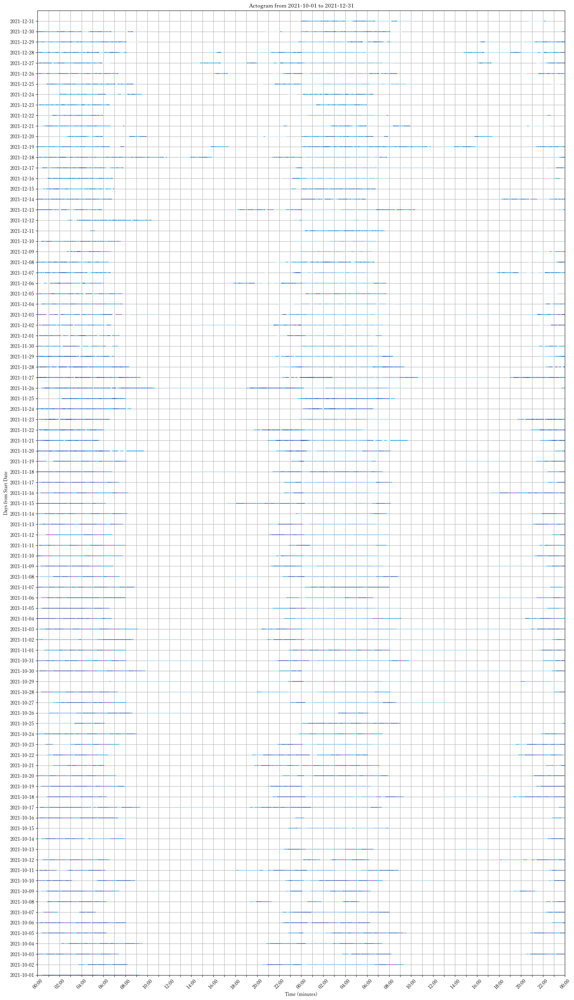
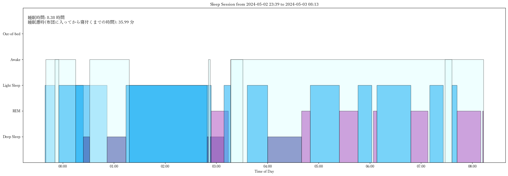

# Sleep Analyze Jupyter Notebook の使い方 (How to use this Jupyter Notebook)
==⚠This document is written in Japanese. For the English version, please refer to [this document](README_ENG_version.md).⚠==

## はじめに

- このノートブックでは、Google Fitのデータを元に睡眠データを分析します
- [Google Fitからデータをダウンロード](https://takeout.google.com/)してください
  - Google Fitからデータをダウンロードする方法が分からない方は[以下のドキュメント](How_to_Download_Sleep_data_from_GoogleFit.md)をご覧ください。
- 日本語での分析をご希望される方は、`Sleep_Analyze_Notebook_JP_version.ipynb`を使用してください。
- このノートブックは、筆者のような**複数のデバイスを使って**睡眠記録をつけている方でも問題なく分析が行えます
- セルは**一括で実行せず、1つずつ実行してください**

## データ分析の流れ
1. モジュールのインポート
2. データの取り込み
3. (手動の睡眠記録がある場合)データセットの選択
4. (必要であれば)データをCSVファイルとしてエクスポート
5. アクトグラムを用いた四半期ごとの睡眠記録の可視化

    
    
6. 四半期ごとの統計
7. 任意の日付の睡眠記録の可視化

    
    